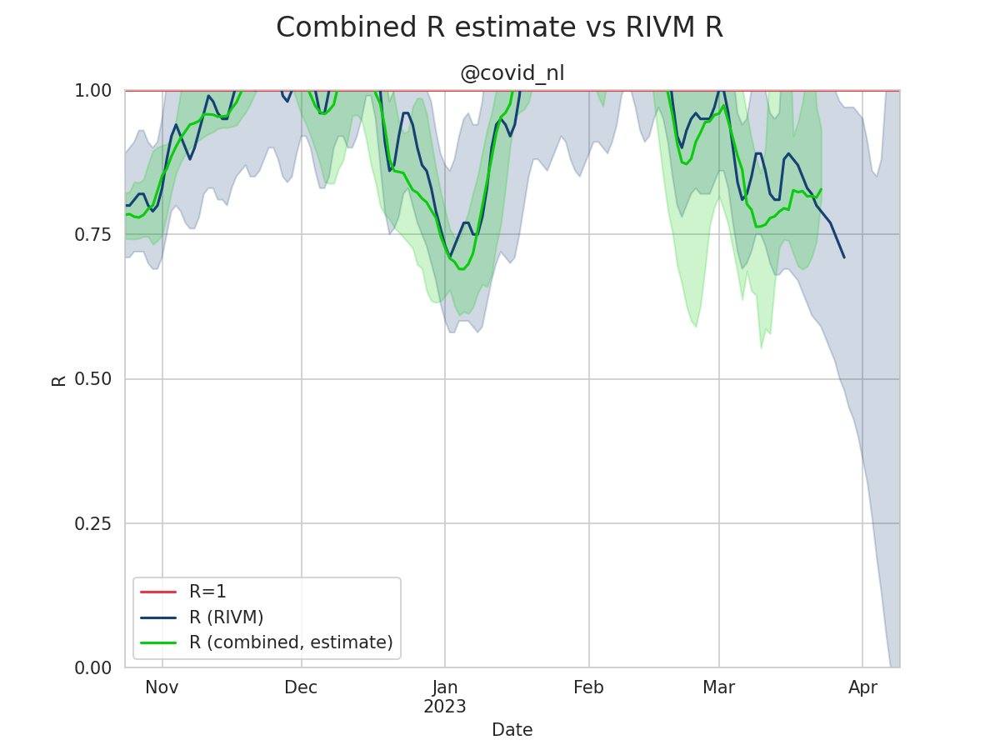
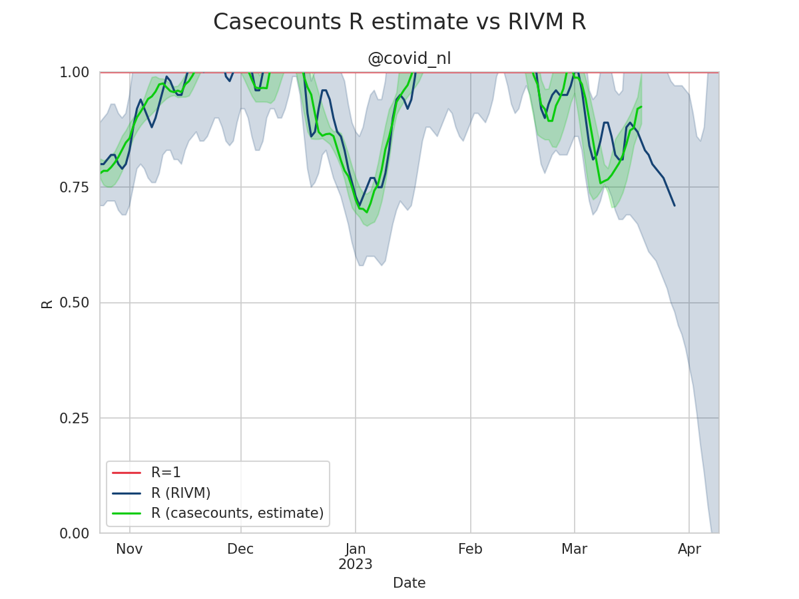
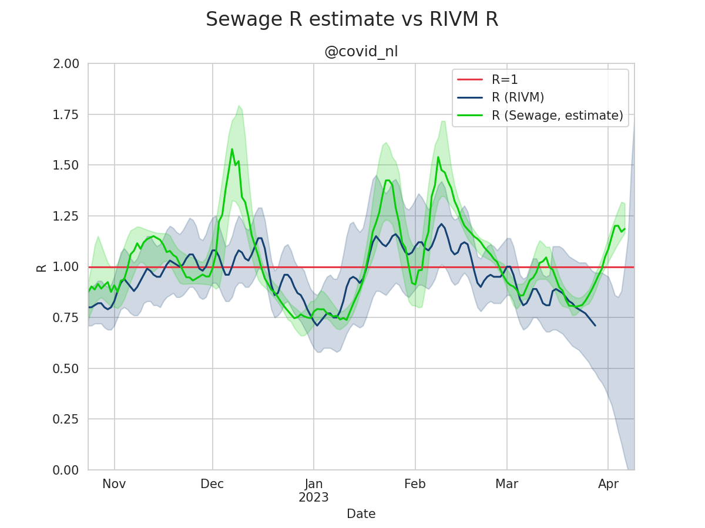

# R-estimates-nl
R as estimated on various time series data compared to the R as calculated by the RIVM. This repo uses Netherlands data only.
  
**Table of Contents**  
* [Plot explanation](#plot-explanation)  
* [Model descriptions](#model-descriptions)
  * [Combined model](#combined-model)
  * [Case-reports casecounts](#case-reports-casecounts)
  * [Municipal casecounts](#municipal-casecounts)
  * [Nursing homes casecounts](#nursing-homes-casecounts)
  * [Sewage](#sewage)
  * [Hospital admissions](#hospital-admissions)
  * [ICU admissions](#icu-admissions)
* [Metrics](#metrics)
* [License and academic use](#license-and-academic-use)

## Plot explanation
All plotted estimates show the following:
* R as calculated by the RIVM in blue, with the upper and lower bands as a blue area
* R as estimated by the model in green, with the upper and lower bands as a green area

Please note that the green line displays the median of all the models estimated curves. This means that 50% of the predicted values are above the median line and 50% of the predicted values are below the median line. The green area shows the predicted curves between the 5th and 95th percentile.

## Model descriptions
Now follow a series of model descriptions.

### Combined model
The combined model uses time series data on sewage, case-counts (case-reports, nursing homes, municipal case counts) and hospital / icu admissions.

[r_combined.csv](data/r_combined.csv)

### Case-reports casecounts
The case-reports casecounts model uses time series [data on individual case-reports](https://data.rivm.nl/covid-19/COVID-19_casus_landelijk.html) as provided by the RIVM.

[r_case-counts.csv](data/r_case-counts.csv)

### Municipal casecounts
The municipal casecounts model uses time series [data on municipal-level case-reports](https://data.rivm.nl/covid-19/COVID-19_aantallen_gemeente_per_dag.html) as provided by the RIVM.

[r_municipal-case-counts.csv](data/r_municipal-case-counts.csv)

### Nursing homes casecounts
The nursing homes casecounts model uses time series [data on nursing homes case-reports](https://data.rivm.nl/covid-19/COVID-19_verpleeghuizen.html) as provided by the RIVM.

[r_nursing-homes.csv](data/r_nursing-homes.csv)

### Sewage
The sewage model uses time series [data on RNA flow per 100K residents](https://data.rivm.nl/covid-19/COVID-19_rioolwaterdata.html) as provided by the RIVM.

[r_sewage.csv](data/r_sewage.csv)

### Hospital admissions
The hospital admissions model uses time series [data on hospital admissions](https://www.stichting-nice.nl/covid-19-op-de-zkh.jsp) as provided by Stichting NICE.

[r_hospital.csv](data/r_hospital.csv)

### ICU admissions
The ICU admissions model uses time series [data on ICU admissions](https://www.stichting-nice.nl/covid-19-op-de-ic.jsp) as provided by Stichting NICE.

[r_icu.csv](data/r_icu.csv)

## Metrics
This project keeps track of the models performance through various metrics. E.g. the R2 score, MSE and correlation metrics. These can be found in [metrics.csv](data/metrics.csv).  
For now the combined model uses all time-series data, but in the future we might want to do some model selection. The project keeps track on the different model combinations in [combo_metrics.csv](data/combo_metrics.csv).

## License and academic use
The graphs and data are licensed [CC0](https://creativecommons.org/share-your-work/public-domain/cc0/). The original data is copyright RIVM and Stichting NICE.
