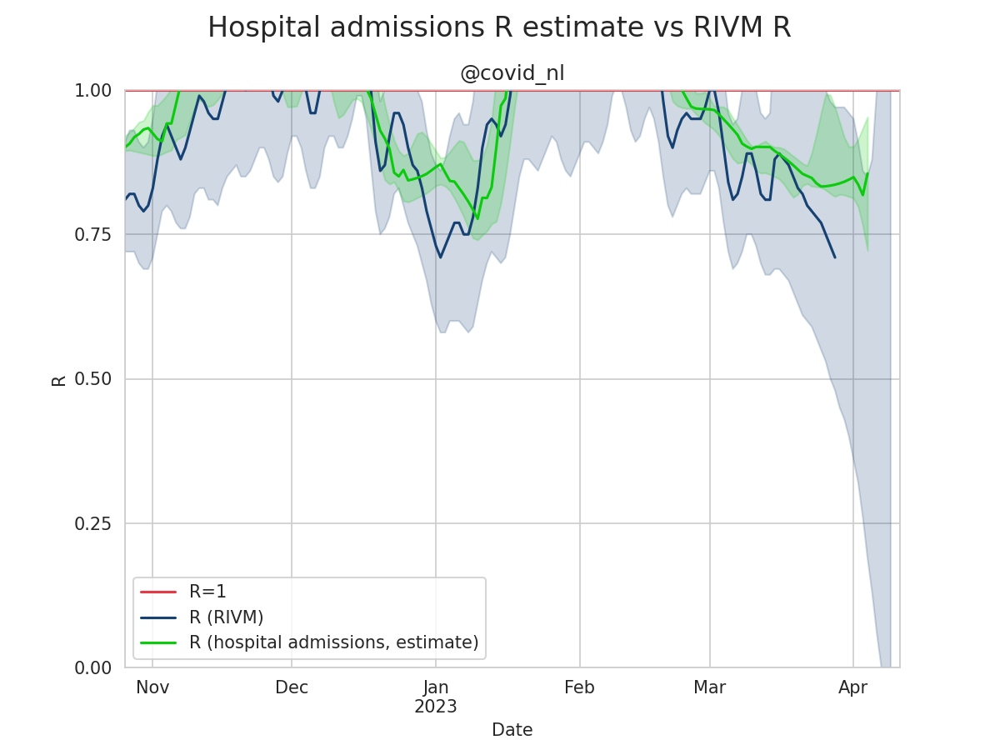
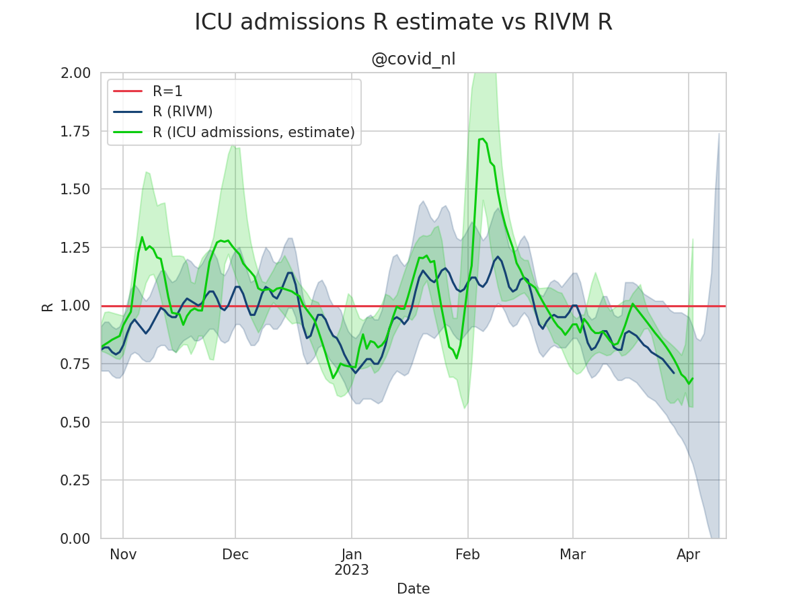
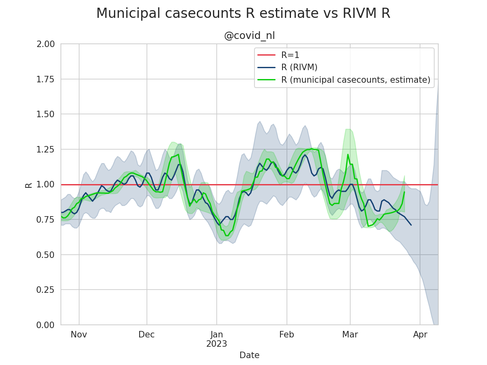
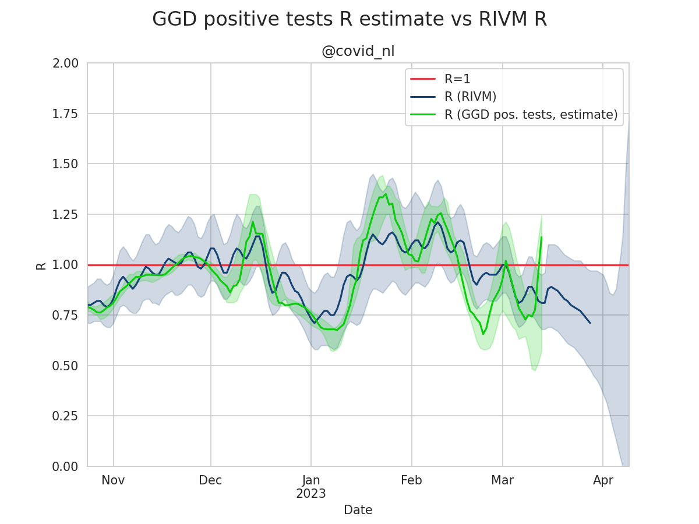
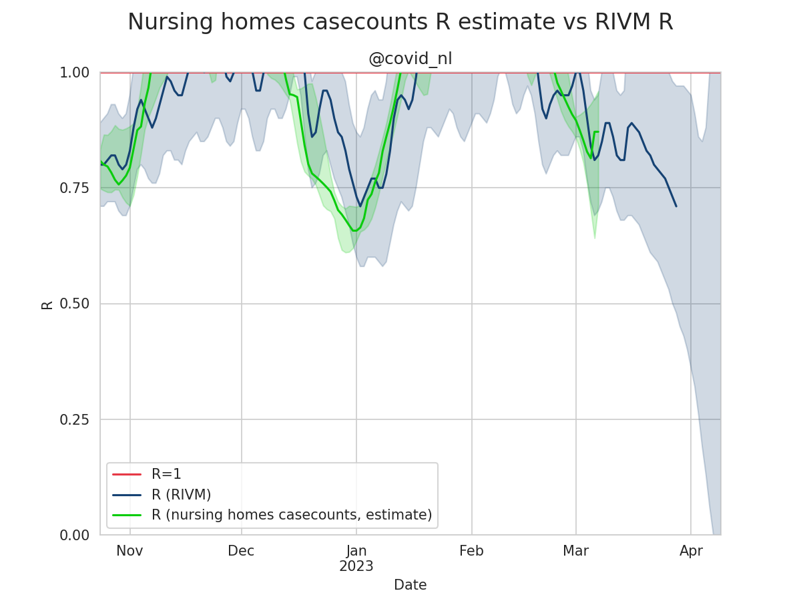

# R-estimates-nl
R as estimated on various time series data compared to the R as calculated by the RIVM. This repo uses Netherlands data only.
   
**Table of Contents**  
* [What is R?](#what-is-r)
* [Why this model?](#why-this-model)
* [How does it work?](#how-does-it-work)
* [Plot explanation](#plot-explanation)  
* [Model results](#model-results)
  * [Sewage](#sewage)
  * [Hospital admissions](#hospital-admissions)
  * [ICU admissions](#icu-admissions)
  * [Combined model](#combined-model)
  * [Case-reports casecounts](#case-reports-casecounts)
  * [Municipal casecounts](#municipal-casecounts)
  * [GGD positive tests](#ggd-positive-tests)
  * [Nursing homes casecounts](#nursing-homes-casecounts)  
* [Metrics](#metrics)
* [License and academic use](#license-and-academic-use)

## What is R?
R is the reproduction number. This is a number that describes if the spread of a disease is growing or shrinking but it does not include time. Rt helps in decision making during outbreaks as it is a clear indicator if the disease is growing (Rt>1), is stable (Rt=1) or if it is shrinking (Rt<1). E.g. if Rt=1 then 1 infected person will, on average, infect 1 additional person. If R=0.9 then one infected person will, on average, infect 0.9 additional person. If R=1.1 then one infected person will, on average, infect 1.1 additional person.  

The Rt can be estimated from any growth rate on e.g. hospitalizations, icu admissions, case-counts and perhaps also sewage data. A formula to get an approximation of Rt based on the growth rate is as follows: `Rt = e^(λ*T)` where `λ = growth rate` and `T = generation interval`. Note: Rt values from the RIVM in NL, are generated from model based estimates instead of using this approximation on time-series data directly.  
Ballpark generation interval numbers for covid are 3 to 5 days. This is the average interval until a newly infected person infects another person. This is the number we need to add time to the equation. This model currently uses a generation interval of 4, but if need be this can be changed to a range of e.g. 3 to 5. However, currently that decreases the models performance vs. the R as calculated by the RIVM. Thus the choice was made to make it a static 4.

## Why this model?
Basing R estimates on case-counts alone is prone to error due to testing systems getting overloaded during large and/or sustained outbreaks. Calculating R estimates over hospital/ICU admissions is prone to healthcare systems getting overwhelmed. Hence this model aims to integrate more datasources, for example sewage data, to produce estimates that might give additional insights into the spread of the virus.

## How does it work?
The time-series data is resampled into seven buckets. One for each day of the week. Polynomials of the 2nd degree are then fitted to resample these buckets from weekly data back to daily estimates. Over each bucket the R is then approximated using the formula `Rt = e^(λ*T)`.  The resulting R values in these seven buckets are then combined to generate the 5th / 50th / 95th percentile. The combined model currently uses all time-series data. It might be helpful to perform model selection to improve the combined model. The models 50th percentile is then compared to the R as calculated by the RIVM and various metrics (pearson, kendall, spearman, R^2, mse, rmse) are produced.

## Plot explanation
All plotted estimates show the following:
* R as calculated by the RIVM in blue, with the upper and lower bands as a blue area
* R as estimated by the model in green, with the upper and lower bands as a green area

Please note that the green line displays the median of all the models estimated curves. This means that 50% of the estimated values are above the median line and 50% of the estimated values are below the median line. The green area shows the estimated curves between the 5th and 95th percentile.

## Model results
Now follows a series of model results.

### Sewage
The sewage model uses time series [data on RNA flow per 100K residents](https://data.rivm.nl/covid-19/COVID-19_rioolwaterdata.html) as provided by the RIVM.

[r_sewage.csv](data/r_sewage.csv)

### Hospital admissions
The hospital admissions model uses time series [data on hospital admissions](https://www.stichting-nice.nl/covid-19-op-de-zkh.jsp) as provided by Stichting NICE.

[r_hospital.csv](data/r_hospital.csv)

### ICU admissions
The ICU admissions model uses time series [data on ICU admissions](https://www.stichting-nice.nl/covid-19-op-de-ic.jsp) as provided by Stichting NICE.

[r_icu.csv](data/r_icu.csv)

### Combined model
The combined model uses time series data on sewage, case-counts (case-reports, nursing homes, municipal case counts), number of positive tests by the GGD and hospital / icu admissions.

[r_combined.csv](data/r_combined.csv)

### Case-reports casecounts
The case-reports casecounts model uses time series [data on individual case-reports](https://data.rivm.nl/covid-19/COVID-19_casus_landelijk.html) as provided by the RIVM.

[r_case-counts.csv](data/r_case-counts.csv)

### Municipal casecounts
The municipal casecounts model uses time series [data on municipal-level case-reports](https://data.rivm.nl/covid-19/COVID-19_aantallen_gemeente_per_dag.html) as provided by the RIVM.

[r_municipal-case-counts.csv](data/r_municipal-case-counts.csv)

### GGD positive tests
The GGD positive tests model uses time series [data on the number of positive tests](https://data.rivm.nl/covid-19/COVID-19_uitgevoerde_testen.html) as reported by the GGD and provided by the RIVM.

[r_ggd-positive-tests.csv](data/r_ggd-positive-tests.csv)

### Nursing homes casecounts
The nursing homes casecounts model uses time series [data on nursing homes case-reports](https://data.rivm.nl/covid-19/COVID-19_verpleeghuizen.html) as provided by the RIVM.

[r_nursing-homes.csv](data/r_nursing-homes.csv)

## Metrics
This project keeps track of the models performance by comparing its outputs with the R as calculated by the RIVM. Various metrics are generated E.g. the R2 score, MSE and correlation metrics. These can be found in [metrics.csv](data/metrics.csv).  
For now the combined model uses all time-series data, but in the future we might want to do some model selection. The project keeps track on the different model combinations in [combo_metrics.csv](data/combo_metrics.csv).

## License and academic use
The graphs and data are licensed [CC0](https://creativecommons.org/share-your-work/public-domain/cc0/). The original data is copyright RIVM and Stichting NICE.  

For academic use, use presistent data from:   

Please cite: `Thomas Phil. (2021). Sikerdebaard/r-estimates-nl: v20211206 (Version v20211206). Zenodo. https://doi.org/10.5281/zenodo.5762029`
